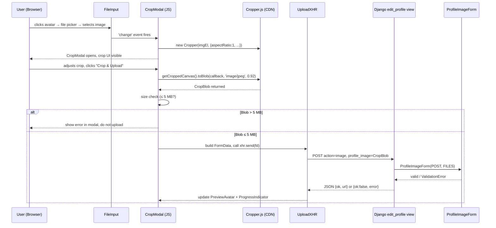

# Design Document: Headshot-Only Profile Photo Upload

## Overview

This feature adds a client-side image-cropping step to the caregiver profile photo upload flow in
the GetMeCare Django project. When a caregiver selects a file via the avatar click target on
`edit-profile.html`, a full-screen modal opens that hosts a **Cropper.js** widget (loaded from CDN,
no npm). The user adjusts a 1:1 square crop region and confirms; the browser then exports the crop
as a JPEG Blob via `canvas.toBlob()` and hands it to the existing AJAX/XHR path that already posts
to `Account:edit_profile` with `action=image`. All existing server-side validation in
`ProfileImageForm` is preserved unchanged.

No new Python dependencies are added. No changes to `views.py` are required unless the existing
file-missing guard needs hardening (it already returns 400 for AJAX with no file).

---

## Architecture



### Key Architectural Decisions

| Decision | Rationale |
|---|---|
| CDN-only Cropper.js | No npm/webpack toolchain exists in this project; CDN matches existing jQuery/Bootstrap CDN pattern in templates |
| Client-side 5 MB guard before XHR | Prevents wasted network traffic; server-side guard in `ProfileImageForm` remains as defence-in-depth |
| 1:1 aspect ratio only | Standard headshot format; simplest UX — users always get a square crop |
| JPEG output at 0.92 quality | Good quality-to-size ratio; JPEG is accepted by all three allowed MIME types flow paths |
| `<dialog>` element for modal | Native browser dialog with built-in Escape-key handling and accessibility (focus trap, aria) |
| No `views.py` changes | The existing `action=image` path already handles a FormData POST with `profile_image`; only the JS changes |

---

## Components and Interfaces

### 1. CDN Script and Stylesheet Tags

Added to the `` section of `edit-profile.html`:

```html
<!-- Cropper.js CSS -->
<link rel="stylesheet"
  href="https://cdnjs.cloudflare.com/ajax/libs/cropperjs/1.6.2/cropper.min.css"
  crossorigin="anonymous" />
<!-- Cropper.js JS — loaded before extra_scripts block -->
<script
  src="https://cdnjs.cloudflare.com/ajax/libs/cropperjs/1.6.2/cropper.min.js"
  crossorigin="anonymous" defer></script>
```

### 2. CropModal HTML Structure

Injected once into the template body (just before ``):

```html
<dialog id="crop-modal" aria-modal="true" aria-labelledby="crop-modal-title">
  <div id="crop-modal-inner">
    <div id="crop-modal-header">
      <span id="crop-modal-title">Crop your headshot</span>
      <button type="button" id="crop-cancel-btn" aria-label="Cancel crop">✕</button>
    </div>
    <div id="crop-container">
      
    </div>
    <!-- Circular preview pane -->
    <div id="crop-preview-wrap">
      <div id="crop-preview"></div>
    </div>
    <div id="crop-modal-footer">
      <p id="crop-size-error" role="alert" hidden>
        Cropped image exceeds 5 MB. Please select a smaller area.
      </p>
      <button type="button" id="crop-confirm-btn">Crop &amp; Upload</button>
    </div>
  </div>
</dialog>
```

### 3. CropModal CSS

Added to the `<style>` block in ``:

```css
/* ── Crop Modal ── */
#crop-modal {
  position: fixed;
  inset: 0;
  margin: auto;
  border: none;
  border-radius: 14px;
  padding: 0;
  width: min(520px, 96vw);
  max-height: 96vh;
  overflow: hidden;
  box-shadow: 0 8px 40px rgba(0,0,0,0.35);
  background: #fff;
}
#crop-modal::backdrop {
  background: rgba(0,0,0,0.65);
}
#crop-modal-inner {
  display: flex;
  flex-direction: column;
  height: 100%;
}
#crop-modal-header {
  display: flex;
  align-items: center;
  justify-content: space-between;
  padding: 16px 20px;
  border-bottom: 1px solid #f0f0f0;
}
#crop-modal-title {
  font-size: 0.95rem;
  font-weight: 700;
  color: #1a1a1a;
}
#crop-cancel-btn {
  background: none;
  border: none;
  font-size: 1.1rem;
  cursor: pointer;
  color: #888;
  padding: 4px 8px;
  border-radius: 6px;
  line-height: 1;
}
#crop-cancel-btn:hover { color: #333; background: #f4f5f0; }
#crop-container {
  flex: 1;
  min-height: 0;
  background: #111;
  max-height: 400px;
}
#crop-image {
  display: block;
  max-width: 100%;
}
#crop-preview-wrap {
  padding: 12px 20px 0;
  display: flex;
  align-items: center;
  gap: 10px;
}
#crop-preview {
  width: 80px;
  height: 80px;
  border-radius: 50%;
  overflow: hidden;
  border: 2px solid #1b7d4f;
}
#crop-modal-footer {
  padding: 12px 20px 18px;
  display: flex;
  flex-direction: column;
  gap: 10px;
}
#crop-size-error {
  color: #c62828;
  font-size: 0.78rem;
  background: #fdecea;
  border: 1px solid #ffcdd2;
  border-radius: 7px;
  padding: 8px 12px;
}
#crop-confirm-btn {
  display: inline-flex;
  align-items: center;
  justify-content: center;
  gap: 7px;
  background: #1b3a2d;
  color: #fff;
  border: none;
  border-radius: 9px;
  padding: 11px 28px;
  font-size: 0.875rem;
  font-weight: 600;
  cursor: pointer;
  font-family: inherit;
  transition: background 0.15s;
}
#crop-confirm-btn:hover { background: #142e21; }
#crop-confirm-btn:disabled {
  background: #aaa;
  cursor: not-allowed;
}

/* Responsive: narrow viewports */
@media (max-width: 600px) {
  #crop-modal { width: 96vw; border-radius: 10px; }
  #crop-container { max-height: min(90vw, 360px); }
}
```

### 4. CropController JavaScript Module

Replaces and extends the existing `extra_scripts` block IIFE in `edit-profile.html`. The existing
XHR upload logic is preserved; the new `CropController` intercepts between `FileInput change` and
`XHR send`.

**Public API (internal IIFE — no exports needed):**

| Function | Description |
|---|---|
| `openCropModal(file)` | Reads the File as a DataURL, sets `#crop-image` src, opens the `<dialog>`, and initialises a new Cropper instance |
| `closeCropModal()` | Destroys the Cropper instance, closes the `<dialog>`, resets `FileInput.value` |
| `confirmCrop()` | Calls `cropper.getCroppedCanvas().toBlob(onBlob, 'image/jpeg', 0.92)` |
| `onBlob(blob)` | Checks `blob.size <= 5*1024*1024`; on pass calls `doUpload(blob)`; on fail shows `#crop-size-error` |
| `doUpload(blob)` | Builds `FormData`, calls the existing XHR logic (progress, load, error handlers unchanged) |

**Event bindings:**

| Event Target | Event | Handler |
|---|---|---|
| `#avatar-file-input` | `change` | `openCropModal(files[0])` |
| `#crop-cancel-btn` | `click` | `closeCropModal()` |
| `#crop-confirm-btn` | `click` | `confirmCrop()` |
| `#crop-modal` | `cancel` (Escape key on `<dialog>`) | `closeCropModal()` |

---

## Data Models

No new database models or migrations are required. The feature only modifies:

- `templates/Account/edit-profile.html` — adds CDN tags, CropModal HTML, CSS, and the
  CropController IIFE
- `Account/forms.py` — no changes required (existing `ProfileImageForm` validation is preserved)
- `Account/views.py` — no changes required (the existing `action=image` handler already accepts
  any `profile_image` file in `request.FILES`)

### Existing `CaregiverProfile.profile_image` field (unchanged)

```python
# Account/models.py (unchanged)
profile_image = models.ImageField(
    upload_to='caregiver_avatars/', blank=True, null=True
)
```

The stored file will now always be a JPEG with a 1:1 aspect ratio produced by the CropController,
but the field definition requires no change.

---

## Correctness Properties

*A property is a characteristic or behavior that should hold true across all valid executions of a
system — essentially, a formal statement about what the system should do. Properties serve as the
bridge between human-readable specifications and machine-verifiable correctness guarantees.*

Based on the prework analysis, three requirements contain genuine property-based testing
opportunities in the server-side Python validation layer (`ProfileImageForm`). The client-side
JavaScript requirements are best covered by example-based tests.

### Property 1: Oversized CropBlob is always rejected client-side

*For any* JPEG Blob whose `size` attribute is strictly greater than 5,242,880 bytes, when
`onBlob(blob)` is called, the UploadXHR SHALL NOT be invoked and `#crop-size-error` SHALL be
visible.

**Validates: Requirements 2.2**

### Property 2: Valid-sized CropBlob always proceeds to upload

*For any* JPEG Blob whose `size` attribute is less than or equal to 5,242,880 bytes, when
`onBlob(blob)` is called, `doUpload` SHALL be called with that Blob and `#crop-size-error` SHALL
remain hidden.

**Validates: Requirements 2.3**

### Property 3: ProfileImageForm rejects any file exceeding 5 MB

*For any* in-memory uploaded file object whose `size` is strictly greater than 5,242,880 bytes,
`ProfileImageForm.clean_profile_image` SHALL raise `forms.ValidationError`.

**Validates: Requirements 3.1**

### Property 4: ProfileImageForm rejects files with invalid magic bytes

*For any* byte sequence that does not begin with one of `\xff\xd8\xff` (JPEG), `\x89PNG` (PNG),
or `RIFF....WEBP` (WebP), `ProfileImageForm.clean_profile_image` SHALL raise
`forms.ValidationError` regardless of the file extension.

**Validates: Requirements 3.2**

### Property 5: ProfileImageForm rejects files with disallowed extensions

*For any* filename whose extension (the substring after the final `.`, lowercased) is not in
`{'jpg', 'jpeg', 'png', 'webp'}`, `ProfileImageForm.clean_profile_image` SHALL raise
`forms.ValidationError`.

**Validates: Requirements 3.3**

---

## Error Handling

| Scenario | Handling |
|---|---|
| User selects a non-image file (e.g. PDF) | `FileReader.onload` produces a DataURL the browser decodes; Cropper.js will fail to load it and raise an `error` event — the modal closes with an alert "Could not load image. Please select a JPG, PNG, or WebP file." |
| `canvas.toBlob` returns `null` (very old browser) | `onBlob` guards for `!blob` and shows the size error message with text "Could not export crop. Please try a different image." |
| Blob > 5 MB after crop | `#crop-size-error` shown inside modal; confirm button re-enabled so user can adjust crop region |
| Network error during XHR | Existing `xhr.addEventListener("error")` handler fires; ProgressIndicator hides; alert shown |
| Server-side validation failure | Existing `xhr.addEventListener("load")` handler parses `{ok:false, error}` and alerts user |
| Escape key pressed | `<dialog>` fires native `cancel` event; `closeCropModal()` resets state cleanly |
| Second click on avatar while uploading | `trigger.style.pointerEvents = "none"` (existing `setUploading(true)` call) prevents re-entry |

---

## Testing Strategy

### Unit / Integration Tests (Python — `Account/tests.py`)

Use Django's `TestCase` with `SimpleUploadedFile` to exercise `ProfileImageForm` directly:

- **Example tests**: valid JPEG uploads accepted, valid PNG accepted, valid WebP accepted
- **Example tests**: file > 5 MB rejected with correct error message
- **Example tests**: bad extension (`.gif`, `.bmp`, `.exe`) rejected
- **Example tests**: truncated/garbage magic bytes rejected
- **Example tests**: AJAX POST with no file returns 400 JSON

### Property-Based Tests (Python — `Account/tests.py`)

Use **Hypothesis** (`pip install hypothesis` — development dependency only):

- **Property 3**: `@given(st.binary().filter(lambda b: len(b) > 5*1024*1024))` → form always raises `ValidationError`
- **Property 4**: `@given(st.binary(min_size=12))` filtered to exclude valid magic prefixes → form always raises `ValidationError`
- **Property 5**: `@given(st.text(alphabet=st.characters(whitelist_categories=('Ll','Lu','Nd')), min_size=1))` filtered to exclude valid extensions → form always raises `ValidationError`

Minimum 100 iterations per property test (Hypothesis default is `max_examples=100`).

Tag format comment above each property test:
```python
# Feature: headshot-profile-photo, Property N: <property text>
```

### JavaScript Tests (Optional — manual or Playwright)

The client-side CropController can be tested with Playwright or manual browser testing:

- Properties 1 & 2: inject Blobs of known sizes, assert XHR called / not called
- Example tests for modal open/close, cancel, Escape key, progress indicator, avatar preview update

No JS test framework is currently configured in this project; recommend Playwright for browser
automation if automated JS tests are desired in future.
